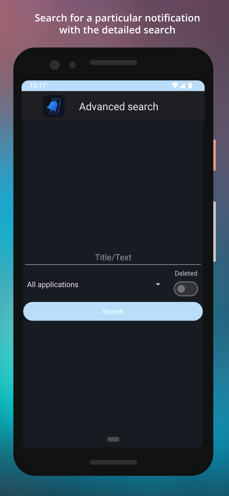

# notification-listener-android

 

 

  
  
  
  

<h2> Description </h2>

This app saves your Android device`s notifications and allows you not to miss notifications that are accidentally deleted or that are deleted by the apps themselves. Feel free to recommend new features.

<h2>📲 Notification Saver - Features</h2>

    <ul>
        <li><strong>✅ Save Notifications</strong> – Automatically stores notifications received on your Android device.</li>
        <li><strong>🔍 Search Notifications</strong> – Easily find past notifications using keywords.</li>
        <li><strong>📂 Organized History</strong> – View notifications grouped by apps for better readability.</li>
        <li><strong>🕒 Detailed Log</strong> – See timestamps, app names, and notification content.</li>
        <li><strong>📊 Graphs</strong> – See some notifications' stats from graph.</li>
        <li><strong>🔔 See Deleted Notifications</strong> – See notifications that were accidentally or automatically deleted.</li>
        <li><strong>🌓 Dark Mode</strong> – Enjoy a sleek UI with dark mode support.</li>
    </ul>

<h2> Requirements </h2>

* Android 7.0+

<h2> Info </h2>

This project use <a href="https://github.com/PhilJay/MPAndroidChart">MPAndroidChart</a> that is licensed under <a href="http://www.apache.org/licenses/LICENSE-2.0">Apache LICENSE-2.0</a>

<h2> Download </h2>

