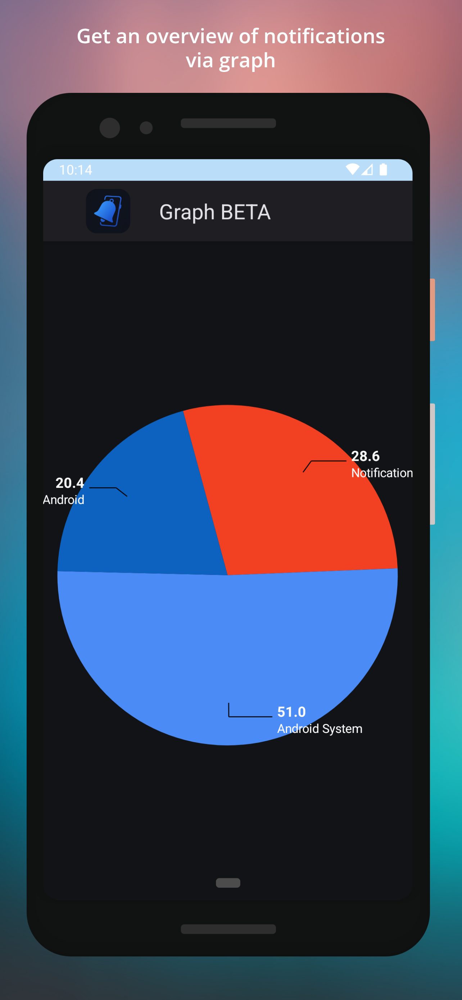

# notification-listener-android

 

 

  
  
  
  

<h2> Description </h2>

This app saves your Android device`s notifications and allows you not to miss notifications that are accidentally deleted or that are deleted by the apps themselves. Feel free to recommend new features.

<h2>📲 Features</h2>

- **✅ Save Notifications** – Automatically stores notifications received on your Android device.  
- **🔍 Search Notifications** – Easily find past notifications using keywords.  
- **📂 Organized History** – View notifications grouped by apps for better readability.  
- **🕒 Detailed Log** – See timestamps, app names, and notification content.  
- **📊 Graphs** – See some notifications' stats from graph.  
- **🔔 See Deleted Notifications** – See notifications that were accidentally or automatically deleted.  
- **🌓 Dark Mode** – Enjoy a sleek UI with dark mode support.
- **🔒 Secure Access** – Enable password or fingerprint authentication to access the app.

<h2> Requirements </h2>

* Android 7.0+

<h2> Info </h2>

This project use <a href="https://github.com/PhilJay/MPAndroidChart">MPAndroidChart</a> that is licensed under <a href="http://www.apache.org/licenses/LICENSE-2.0">Apache LICENSE-2.0</a>

<h2> Download </h2>

    
    
    

